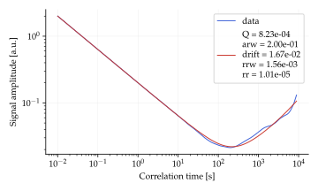
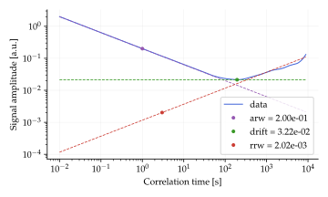

# AllanNoises.jl

Package to simulate an IMU signal and extract the noise values from an Allan deviation log-log plot.


### Example
``` julia
using Pkg
Pkg.add(url="https://github.com/gabriellnuness/AllanNoises.jl")

using AllanNoises, AllanDeviations, Random

Random.seed!(3)
# creating signal
fs = 100.0
time = 5*60*60
t = range(start=0, stop=time, step=1/fs)
n = length(t)
y = @. 2*randn(n) + cumsum(2e-4*randn(n))   # creating a simulated noisy signal
adev = allandev(y, fs, frequency=true)

noises = allan_fit(adev.tau, adev.deviation)
noises_simp = allan_fit_simple(adev.tau, adev.deviation)

```

`allan_fit()` and `allan_fit_simple()` provide the following outputs:



